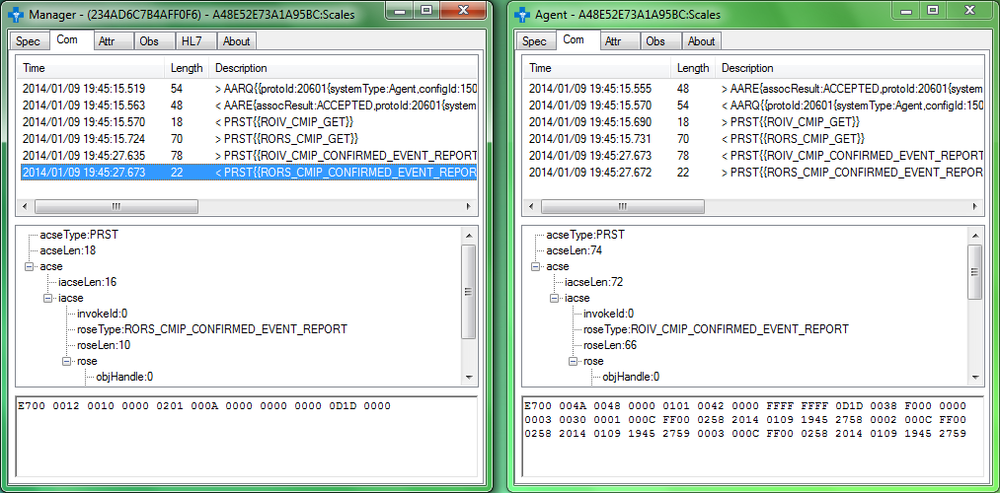

# IEEEAgentManager
IEEE Agent - Manager

Windows implementation of 11073 communication protocol including analysis of corresponding messages and objects / attributes

- Compliant with Continua Health Alliance
- Supports: Message queuing, Serial port, TCP, HTTP
- Shows binary 11073 messages, objects / attributes, observations and corresponding HL7 messages
